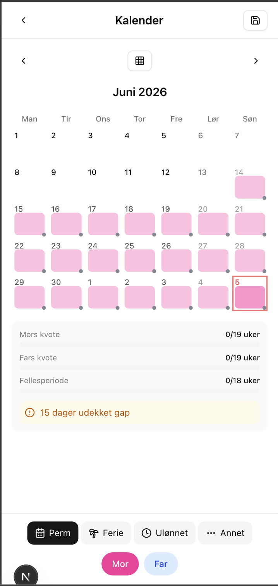
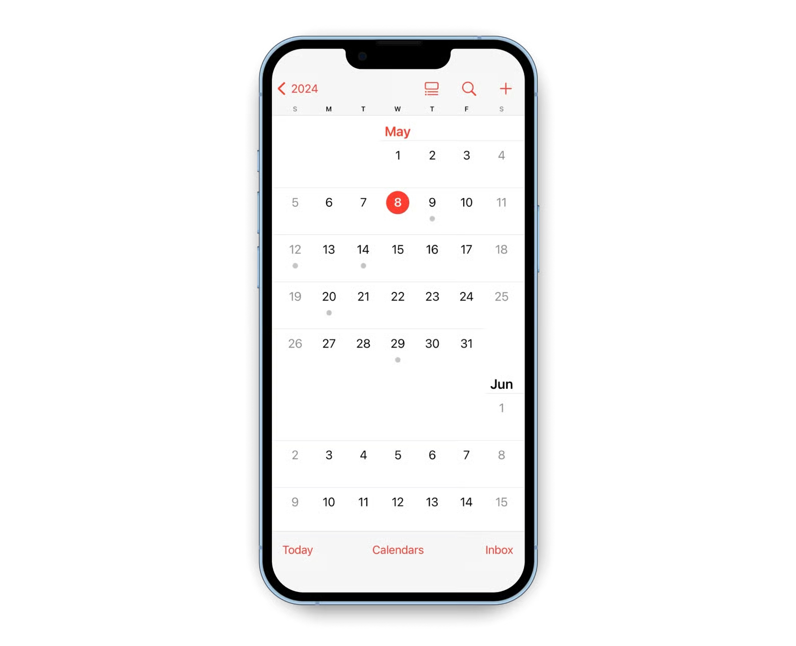
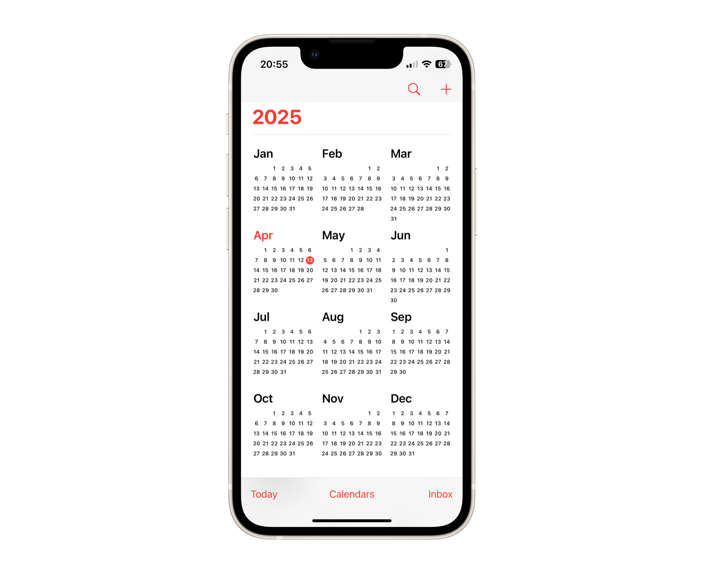
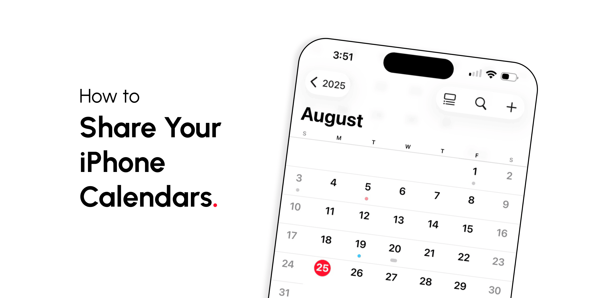

# TODO etter implementasjon av wizard og v2 MVP

## Subagents

- Lage en subagent som kan hjelpe oss meg god brukertesting, teste logikk og sånt, for å finne feil og forbedringer.
- Lage en subagent som kan hjelpe oss med å lage gode tekster, for å forbedre brukeropplevelsen og gjøre det enklere for brukerne å forstå hva de skal gjøre.
- Lage en subagent som kan hjelpe oss med å lage gode design, for å forbedre brukeropplevelsen og gjøre det enklere for brukerne å navigere i appen.

## Found bugs

- man kan klikke på en dag flere ganger, så "spises" uker opp for mor (jeg har ikke endret noen av instillingene, prøvde bare å gå litt fram i mnd og klikket på en dag flere ganger, så forsvant uker for mor).
- wizard: barnehagestart, her må vi sette dato på foreslått dato som vi gjorde i gammel versjon basert på termindato. så når brukeren ser dato-velger komponent, så må det være en "riktig" estimert dato, ikke dagens dato.
- i termindato-valg må det være mulig å endre år eller mnd mer enn en mnd av dagen, så vi må utvide komponentet for å velge dato her

## UI Issues

- Vi må prøve å holde alle wizard-sidene på en skjerms høyde, og unngå scrolling, da må vi evt se på alternativer for å designe komponenter som brukes for å komprimere innholdet vertikalt. kanskje med unntak av oppsummerings-siden, men vi burde prøve på den også
- jeg forstår ikke helt den nye kalenderen, legger ved bilde her: 
  - hva er en grå prikken?
  - hva er de forskjellige rosa fargene?
  - kan vi få rød farge på røddager, som søndag og helligdager?

## Kalender-forslag

- Prøve en tilnærming lik iPhone sitt design
  - 
  - 
  - 
